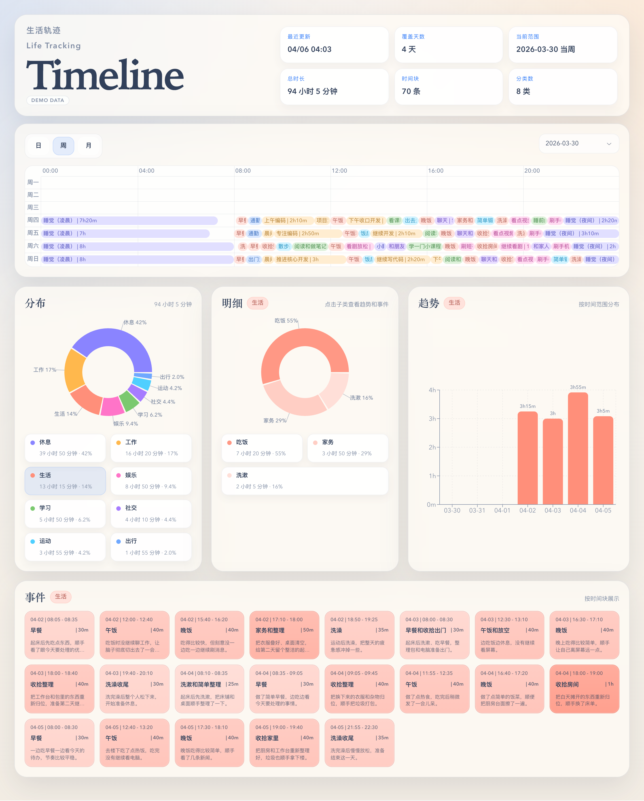

# Timeline for Agent

本地优先的 agent 时间轴工具：

- 增量写入 `facts + taxonomy`
- 构建静态 dashboard
- 本地预览和热更新
- Playwright 截图

适用前提：

- agent 上下文里有明确时间戳
- agent 能执行命令、读写文件

## Dashboard 预览

主视图示例：



其他局部截图效果可在 `examples/` 查看：

- `timeline-dashboard-timeline-view.png`
- `timeline-dashboard-analytics-view.png`
- `timeline-dashboard-events-view.png`

## CLI

```bash
timeline-for-agent help
timeline-for-agent categories
timeline-for-agent proposals
timeline-for-agent read --help
timeline-for-agent write --help
timeline-for-agent read --date 2026-04-06
timeline-for-agent write --date 2026-04-06 --stdin
timeline-for-agent build
timeline-for-agent serve
timeline-for-agent dev
timeline-for-agent screenshot --help
timeline-for-agent screenshot
```

## 写入约束

- 所有 `events` 都必须落在对应 `date` 当天内，不能跨天
- 睡眠如果跨过 `00:00`，需要拆成两段写：
  一段是当天凌晨的睡眠，一段是当天夜间入睡后的睡眠
- 不要写一条从当天晚上直接跨到第二天早上的事件

## 读取和修改流程

- 如果不确定该复用哪个 category / subcategory / eventNode，先执行 `timeline-for-agent categories`
- 如果是补充新内容，且上下文已经足够、目标日期明确、写入位置也明确，可以直接执行 `timeline-for-agent write`
- 如果是修改、删除、覆盖或替换已有内容，先执行 `timeline-for-agent read --date YYYY-MM-DD`
- `read` 只返回目标日期的受控事件数据，不返回完整 facts 或 taxonomy
- 确认要改的事件后，再执行 `timeline-for-agent write`
- 如果要排查新增了哪些 eventNode 提案，执行 `timeline-for-agent proposals`
- 不推荐直接读取或修改原始 JSON 文件

## Agent 集成

- 接入 agent 时，优先让模型调用现有 CLI，不要先读源码理解用法
- 只有在命令报错、用户要求改实现、或需要新增能力时，才进入读源码路径
- 推荐的共享约束写法见 [agent-instructions.md](./docs/agent-instructions.md)
- 未来封装 MCP 时，tool description 模板见 [mcp-tool-descriptions.md](./docs/mcp-tool-descriptions.md)

## 局部截图

- `timeline-for-agent screenshot` 默认截整页
- 如果只截局部，优先使用受控 selector，而不是临时编 CSS
- 当前支持三个内置值：
  - `timeline`：时间轴区域
  - `analytics`：类别分布、子类明细和趋势三块分析区
  - `events`：事件明细区

示例：

```bash
timeline-for-agent screenshot --selector timeline
timeline-for-agent screenshot --selector analytics
timeline-for-agent screenshot --selector events
```

推荐的自然语言描述：

- “截时间轴” / “只截 timeline”
- “截类别明细趋势” / “截分析区”
- “截事件” / “只截事件列表”

只有在这三类都不满足时，才传自定义 CSS selector。
